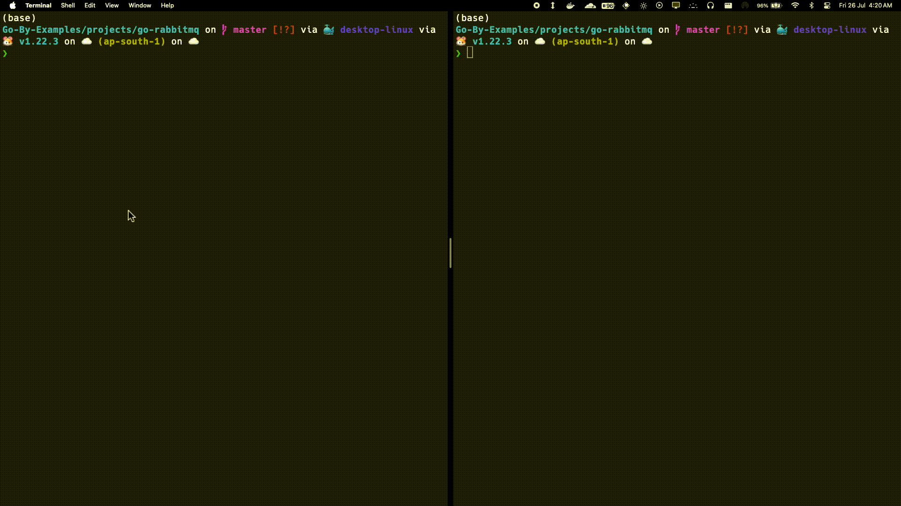

# RabbitMQ Implementation in Golang

## Introduction

This tutorial will guide you through the implementation of RabbitMQ in a Golang project. RabbitMQ is a message broker that allows applications to communicate with each other by sending and receiving messages.

Learn more about [RabbitMQ](https://www.rabbitmq.com/tutorials)

## Prerequisites

Before you begin, ensure you have the following:

- **[Task](https://taskfile.dev/installation/)** installed on your machine
- **Golang** installed on your machine
- **Docker** installed on your machine

## Installation

### Installing Golang

Follow the instructions on the [official Golang website](https://golang.org/doc/install) to install Golang.

## Setup

### Installing Dependencies

Install the required dependencies client library for Go:

```sh
task dep-install
```

### Setting up the Environmert

Start the RabbitMQ docker container for development

```sh
task setup
```

### Running the Program

We will need two different Terminal Windows

- In the first window run

```sh
go run recieve/recieve.go
```

- In the second window run:

```sh
go run send/send.go
```

